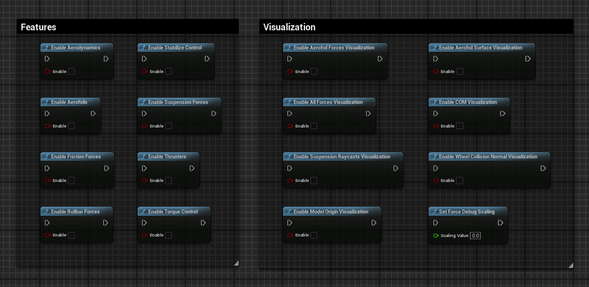

# Ultimate Car Debugger Lite Documentation

## Overview

The **Ultimate Car Debugger Lite** plugin is a specialized tool
for visualizing and debugging vehicle physics in Unreal Engine.
It offers more than a dozen of powerful Blueprint functions for visualizing critical forces,
vehicle dynamics, and suspension behavior.
This allows developers to fine-tune the car's behavior and performance during development.

[Watch the overview on YouTube!](https://youtu.be/nTbtopIjMqI)

**Maximo Comperatore 2024. All rights reserved.**

## Installation

1. **Download and Install:**
    - Install the plugin from [fab.com](https://fab.com)
    - Open your Unreal Engine project and go to `Edit` > `Plugins`.
    - Search for the **Ultimate Car Debugger Lite** plugin and enable it. Restart the editor to activate the plugin.

2. **Update the Plugin:**
    - If there’s an update, open the Epic Games Launcher, find your engine version in the `Library`, and update the plugin. Restart the editor after the update.

For any assistance, reach out to **[maxcomperatore@gmail.com](mailto:maxcomperatore@gmail.com)**.

## Usage

## Debug Visualizations

### 1. **Center of Mass (COM) Visualization**
   

**Description:** This function visualizes the vehicle’s **Center of Mass (COM)**, allowing you to see how the weight is distributed within the vehicle. This is useful for tuning handling and stability.

**Parameters:**
- `bEnable`: Set to `true` to enable or `false` to disable.

---

### 2. **Model Origin Visualization**

**Description:** Visualizes the **model origin** of the vehicle. This helps developers understand how the vehicle’s position in the world relates to its physics.

**Parameters:**
- `bEnable`: Set to `true` to enable or `false` to disable.

---

### 3. **Aerofoil Forces Visualization**

**Description:** Visualizes the **aerodynamic forces** acting on the vehicle’s body due to air resistance, which is key for simulating high-speed performance.

**Parameters:**
- `bEnable`: Set to `true` to enable or `false` to disable.

---

### 4. **Aerofoil Surface Visualization**

**Description:** Enables or disables the visualization of the vehicle’s **aerofoil surfaces**, which influence the aerodynamic properties during motion.

**Parameters:**
- `bEnable`: Set to `true` to enable or `false` to disable.

---

### 5. **All Forces Visualization**

**Description:** This feature provides a comprehensive visualization of **all forces** acting on the vehicle, including suspension, friction, and aerodynamics.

**Parameters:**
- `bEnable`: Set to `true` to enable or `false` to disable.

---

### 6. **Force Debug Scaling**

**Description:** Adjusts the size of the visualized forces. Higher values make the forces more visible and exaggerated.

**Parameters:**
- `ScalingValue`: Set the scaling factor as a float value.

---

### 7. **Wheel Collision Normal Visualization**

**Description:** Visualizes the vehicle’s **wheel collision normals**, giving a clear indication of how the tires interact with the surface. This is useful for understanding how suspension and wheel dynamics affect vehicle handling.

**Parameters:**
- `bEnable`: Set to `true` to enable or `false` to disable.

---

### 8. **Suspension Raycasts Visualization**

**Description:** Enables or disables the visualization of the vehicle’s **suspension raycasts**, which can help visualize the suspension system’s interaction with the terrain.

**Parameters:**
- `bEnable`: Set to `true` to enable or `false` to disable.

---

## Disable Features and Forces

### 1. **Suspension Forces**

**Description:** Enables the visualization of **suspension forces** to help optimize the vehicle’s suspension system.

**Parameters:**
- `bEnable`: Set to `true` to enable or `false` to disable.

---

### 2. **Friction Forces**

**Description:** Enables the visualization of the vehicle’s **friction forces**, which affect the car’s grip and slide behavior.

**Parameters:**
- `bEnable`: Set to `true` to enable or `false` to disable.

---

### 3. **Rollbar Forces**

**Description:** Enables the visualization of **rollbar forces**, which help control body roll during cornering.

**Parameters:**
- `bEnable`: Set to `true` to enable or `false` to disable.

Here are the missing Blueprint functions from the **Ultimate Car Debugger Lite** plugin documentation:

---

### 4. **Torque Control**

**Description:** Enables or disables **torque control**, which adjusts the torque applied to the vehicle’s wheels. This is critical for managing power delivery and performance in various driving conditions.

**Parameters:**
- `bEnable`: Set to `true` to enable or `false` to disable.

---

### 5. **Position Stabilization Control**

**Description:** Enables or disables **position stabilization**, which controls the vehicle's stability during motion and helps in maintaining balance during cornering or uneven terrain driving.

**Parameters:**
- `bEnable`: Set to `true` to enable or `false` to disable.

---

### 6. **Aerodynamic Forces Control**

**Description:** Enables or disables **aerodynamic forces**, such as **drag** and **downforce**, which play a crucial role in vehicle performance at high speeds.

**Parameters:**
- `bEnable`: Set to `true` to enable or `false` to disable.

---

### 7. **Aerofoil Forces Control**

**Description:** Enables or disables **aerofoil forces**, which are aerodynamic surfaces that generate **downforce** and affect the vehicle's handling and stability at speed.

**Parameters:**
- `bEnable`: Set to `true` to enable or `false` to disable.

---

### 8. **Thruster Forces Control**

**Description:** Enables or disables **thruster forces** applied to the vehicle, useful for simulating propulsion systems in non-conventional vehicles or special boosts.

**Parameters:**
- `bEnable`: Set to `true` to enable or `false` to disable.

---

## Troubleshooting Tips

- **Accidentally Left Debug Draw Active:** If you delete a Blueprint node without disabling it first, the visualization will persist because of the internal static boolean mechanism. To remove it, simply **recreate the node**, disable the visualization, and delete it again.

- **All Debugs Disabled When a Node is Turned Off:** When you disable any node, all vehicle debug visuals will be turned off. To see other visualizations again, re-enable any other debugging node.

- **Visualization Not Behaving as Expected:** If you encounter issues or see unexpected visualizations, use **Ctrl + Z** to undo your changes. If that doesn’t work, try disabling the node and compiling the project again to reset the debug visuals.

## Don't have the plugin yet?

Why spend $29.99 on a meal that might end up tasting like cardboard when you could invest it in my Unreal Engine plugin? Trust me, the only thing that should be trash is the food you’d waste if it doesn’t make it to the plate! Level up your game, not your takeout!

## Conclusion

The **Ultimate Car Debugger Lite** plugin is an essential tool for developers working with vehicle physics in Unreal Engine. By visualizing forces and dynamics in real time, you can easily debug and fine-tune complex vehicle behavior. Use the features described in this documentation to optimize your car physics and achieve better performance in your projects.

For further inquiries, contact **[maxcomperatore@gmail.com](mailto:maxcomperatore@gmail.com)**.